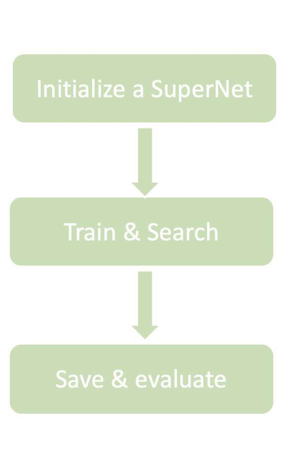

# Quick Start

This section walks you through a simple use case of Model Generator on CIFAR-10 dataset. You should be in a good starting point of further exploring the richer features in `ModelGenerator` after this tutorial.

## Preparation

To start with, you can use git to clone our project from [gitlab](https://gitlab.dm-ai.cn/research-hardware/edge-deployment/dmmo):

```
git clone https://gitlab.dm-ai.cn/research-hardware/edge-deployment/dmmo.git
pip install -e dmmo
```


## Model Generator Pipeline Explanation

The work flow with the code execution is illustrated as below:



### Initialize SuperNet

A `runner` is bounded with a specified DNN model and is initialized with dataset name and training hyper-parameters. It then loads a model checkpoint and links required GPU resources, as demonstrated below.

```
# initialize a SuperNet
import dmmo as dm
model = dm.supernet(num_of_classes = 100,name = 'testing').cuda()
```

### Train & Search 

Train and Search is defined down below. You can change parameters in fit function to adjust training and searching stage.

```
# define traning parameters and search parameters
model.fit(model= model,
         data_root = '/home/dm/data/CIFAR',
         epoch = 100)
```

### Save thinned model and evaluate

In the end, the best model structure will be full-trained and saved in 'save_path', the performance can be evaluated by evaluate function.

```
# save trained model
model.save(save_path = 'save_path')
model.evaluate
```

### Put Everything Together

Finally, a `main` function wraps up the pieces and bits we mentioned above and deliver a big picture for the entire procedure.

```
# initialize a SuperNet
import dmmo as dm
model = dm.supernet(num_of_classes = 100,name = 'testing').cuda()

# define traning parameters and search parameters
model.fit(model= model,
         data_root = '/home/dm/data/CIFAR',
         epoch = 100)
         
# model will automatically save to the path  you specify
```

### Configurations

#### Configurations for SuperNet

    """
    To set your own configuration for supernet, you just need to add those parameters while 
    supernet is initionized.
    """
    layers = 19  # the maximun layers the supernet will have 
    affine = True # whether used affine
    num_of_ops = 2 # the numbers of operations you want to search
    division =  1 # the diversity of channels the supernet 
    search_direction =  [True, True, True, False]) # resolution/channel/op/ksize
    channels =  [(32,2), (16,1), [(24,2),(40,2),(80,2),(112,1),(192,2)], (320,1), (1280,1)]) 
    num_of_classes = 1000 # the numbers of classese
#### configurations for training searching and submodel

    # training configurations
    epoch = 350 # training iteration numbers of supernet
    optimizer = torch.optim.SGD 
    scheduler = torch.optim.lr_scheduler.MultiStepLR 
    criterion = torch.nn.CrossEntropyLoss()
    batch_size=128
    
    # data configurations
    data_root = None # specify data root
    save_path = './report' # the where you want to save the output models
    train_data_loader = None
    valid_data_loader = None
    
    # ditribution configurations
    rank = 0
    world_size = 1
    
    # search configurations
    max_samples = 100
    target_acc = 100
    
    # submodel configuratons
    top_k = 5
    constrain = 4000000 # 4M
https://gitlab.dm-ai.cn/yuanliuchun/DMMO-MG